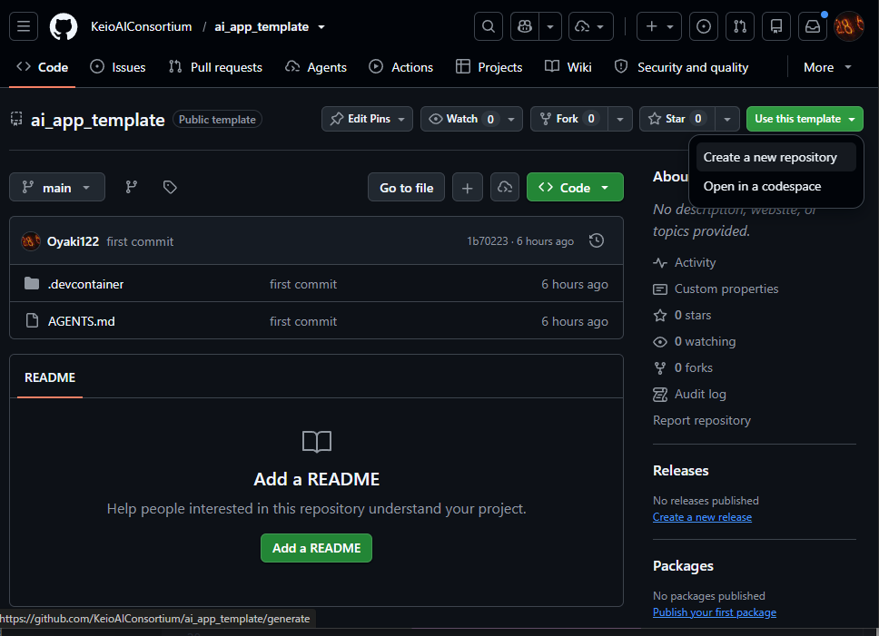
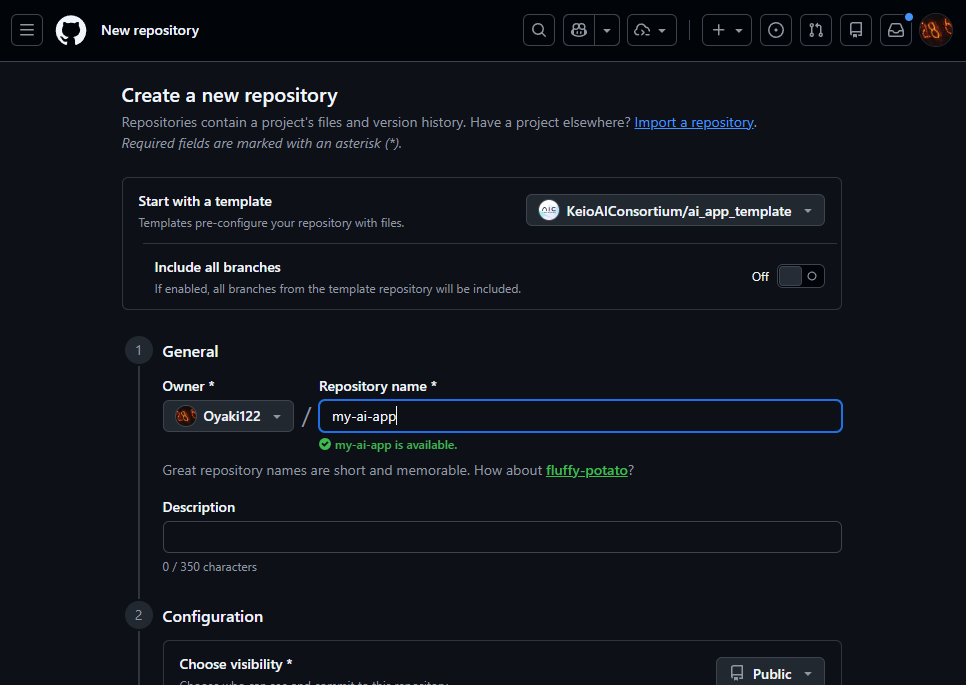
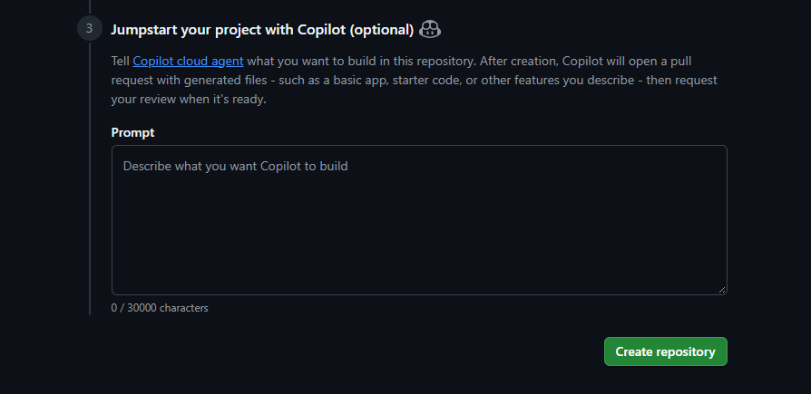
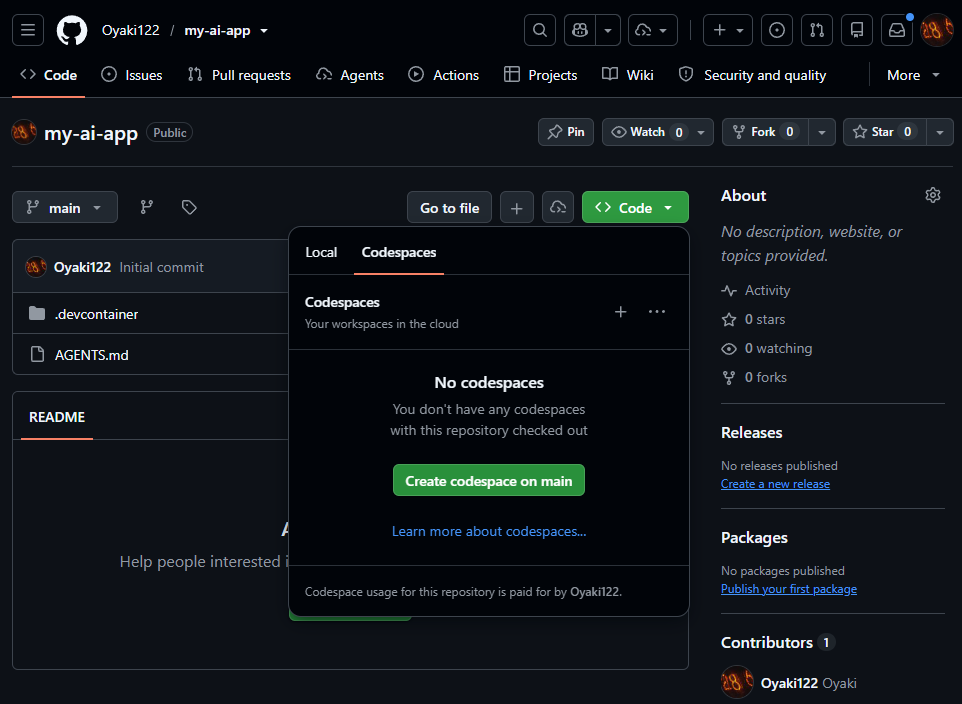
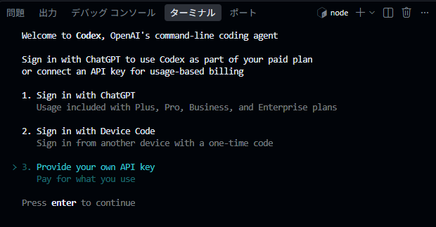
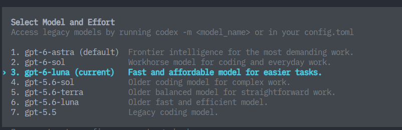
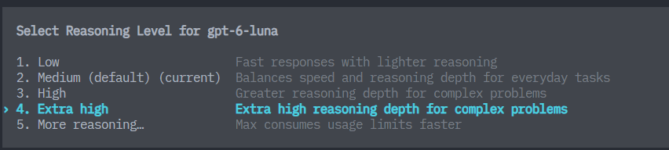

# 開発環境の準備

本講義中は、GitHub Codespacesを用いてCodex CLIを利用します。
GitHub Codespacesは、クラウド上で開発環境を提供するサービスで、ブラウザーだけで開発環境を利用できます。
これにより、インストールやセットアップの手間を省き、すぐに開発を始めることができます。

---

## GitHub Codespacesとは

GitHubが提供するクラウドの開発環境です。
[GitHub Codespaces](https://github.com/features/codespaces)

* **環境構築不要**
  通常、プログラミングや開発を行う際は複数のツールをインストールする必要がありますが、Codespaces上のマシンには主要なツールがすでにインストールされています。
  自分のPCには何もインストールしなくても、すぐに開発を始められます。

* **どのPCでも同じ環境**
  クラウド上で開発を行うことができるため、個人のPCの設定などに左右されず、チーム全員が同じ設定で作業できます。

---

## GitHub Codespacesでの作業手順

まずはじめに、GitHubでテンプレートからリポジトリを作成しましょう。

### テンプレートからGitHub リポジトリを新規作成

* リポジトリとは、Gitで管理しているフォルダー、ディレクトリのことです。

<details markdown="1">
<summary>補足：💡フォルダー、ディレクトリ、リポジトリの違い</summary>

#### **フォルダー**

* パソコンの中でファイルを入れる「入れ物」
* 物理的なディレクトリ構造の見た目のこと

---

#### **ディレクトリ**

* フォルダーとほぼ同じ意味ですが、**コンピューター用語寄り**
* ターミナルやコマンドラインで「今いる場所」を指すときに「ディレクトリ」と言う
* 例：`cd my-ai-app` は「my-ai-app」というディレクトリに移動するという意味です。

---

#### **リポジトリ（Repository）**

* Gitで管理されているフォルダー（＋その中の履歴データ）
* 普通のフォルダーとの違いは「中に `.git` という隠しフォルダーがあり、過去の履歴や設定が入っている」こと
* GitHubにアップすると、そのままインターネット上のリポジトリにもなります。

</details>

1. [GitHub にログイン](https://github.com/login)
2. [AIアプリ用のテンプレートリポジトリ](https://github.com/KeioAIConsortium/ai_app_template)のページにアクセスします。
3. 右上の「Use this template」をクリックし、「Create a new repository」を選択します。
   
4. Repository name に任意の名前（例：`my-ai-app`）を入力し、**Create repository** をクリックします。
   
   

5. 右上のCode ボタンをクリックし、**Codespaces** タブを選択して、**Create codespace on main** をクリックします。
   

作成から起動までに1〜3分ほどかかる場合があります。ブラウザーは閉じずにそのまま待ちましょう。
起動後、ターミナルに「Codex CLI is installed」と表示されるまで待ちましょう。

<details markdown="1">
<summary>Codespacesの料金について</summary>

Codespacesは毎月一定量まで無料で使用することができます。
個人用のGitHubアカウントには、月あたり15GBのストレージと、120コア時間の使用時間が付与されます。
コア時間は使用するマシンのスペックによって消費量が異なります。
2コアマシンを1時間使うと2コア時間を消費し、8コアマシンを1時間使うと8コア時間という計算です。
詳しくは[GitHub Codespacesの料金について](https://docs.github.com/ja/billing/concepts/product-billing/github-codespaces)をご確認ください。

</details>

---

## Codespacesの画面構成

GitHub Codespacesは、クラウド上で動作するVS Code（Visual Studio Code）です。
VS Codeは、Microsoftが提供する無料のソースコードエディターで、多くのプログラミング言語をサポートし、拡張機能を通じて機能を追加することができます。

Codespaces/VS Codeの画面構成について簡単に説明します。


1. **ファイルエクスプローラー**
   左側に表示されるファイルエクスプローラーは、プロジェクト内のファイルやフォルダーを表示します。ここからファイルをクリックすることで、エディターで開くことができます。

2. **エディター**
   画面中央に位置するエディターは、コードを編集するための領域です。シンタックスハイライトやコード補完機能が利用でき、効率的にコードを書くことができます。

3. **ターミナル**
   画面下部に表示されるターミナルは、コマンドを実行するためのインターフェースです。ここでGitコマンドやnpmコマンドを実行して、プロジェクトの管理やビルドを行うことができます。
   上部の「＋」ボタンをクリックすると、新しいターミナルを開くことができます。

4. **(サイドバー)**
   画面右側にサイドバーが表示される場合があります。サイドバーではVSCode内蔵のAIアシスタントを利用できますが、Codex CLIを使う場合は使用しません。
   もしサイドバーが邪魔な場合は、右上の「×」ボタンで閉じることができます。

## Codex CLIの起動

「+」ボタンをクリックして新しいターミナルを開き、`bash` と表示されているタブで以下のコマンドを実行します。

```bash
codex
```

実行すると、以下のようにログイン画面が表示されます。




この講義では、**APIキー**を使ってCodex CLIにサインインします。
APIキーは、AIを使うための合言葉のようなものです。他人に見せたり、GitHubや公開ページに貼ったりしないでください。
講義用APIキーが配布される場合は、先生やTAの案内に従って入力します。

講義では、ChatGPTアカウントでのサインイン手順は扱いません。画面に複数の認証方法が表示された場合は、APIキーを使う選択肢を選んでください。


**API key** と書いてあるところに、講義中に案内されたAPIキーをペーストします。
講義用APIキーが配布される場合は、下の欄に授業中に共有されたパスワードを入力すると表示できます。

<div class="api-key-unlocker" data-api-key-unlocker data-key-url="{{ '/assets/data/class-api-key.enc.json' | relative_url }}">
  <form data-api-key-form>
    <label for="class-api-key-password">講義用APIキーのパスワード</label>
    <div class="api-key-form-row">
      <input id="class-api-key-password" type="password" autocomplete="off" data-api-key-password>
      <button type="submit" data-api-key-submit>APIキーを表示</button>
    </div>
  </form>
  <p class="api-key-status" data-api-key-status role="status" aria-live="polite"></p>
  <div class="api-key-result" data-api-key-result hidden>
    <label for="class-api-key-output">APIキー</label>
    <div class="api-key-output-row">
      <input id="class-api-key-output" type="text" readonly data-api-key-output>
      <button type="button" data-api-key-copy>コピー</button>
    </div>
  </div>
</div>

<details markdown="1">
<summary>講師向け：講義用APIキーを公開する手順</summary>

授業前に、ローカルで次のコマンドを実行します。入力したAPIキーとパスワードは画面に表示されません。

```bash
node scripts/encrypt-class-api-key.mjs
```

作成された `assets/data/class-api-key.enc.json` をGitHub Pagesに公開すると、このページのフォームから復号できます。授業後はOpenAI Platform側で講義用APIキーを削除してください。

</details>


成功すると、上記のような画面になります。
失敗する場合は、APIキーのコピー漏れや入力場所を確認してください。講義用APIキーを使っている場合は、先生やTAに確認しましょう。

## 重要：モデルの選択

Codexでは、作業に使うAIのモデルを選べます。

2026年9月現在のGPT-6系には、次の3つがあります。

- `gpt-6-astra`：複雑な作業が得意
- `gpt-6-sol`：難しい作業が得意
- `gpt-6-terra`：性能とコストのバランスを重視
- `gpt-6-luna`：速さとコストを重視

**この講義では `gpt-6-luna` を使います。**

Codexを起動している画面で、

```
/model
```

と入力してください。



上下の矢印キーで `gpt-5.6-luna` に移動し、Enterキーを押します。

> モデル名や画面は更新されることがあります。`gpt-5.6-luna` が見つからないときは、先生やTAに聞いてください。

次に、Reasoning Levelを選びます。Reasoning Levelは、AIが答える前に「どのくらいじっくり考えるか」の設定です。



どれを選んでも進められますが、**この講義では `Extra high` を選びます。** 上下の矢印キーで移動し、Enterキーを押してください。

Reasoning Levelを高くすると難しい問題をじっくり考えられますが、回答までの時間が長くなることがあります。

---

### 補足

* Codex CLIを終了するには、CLIを実行しているターミナルで `Ctrl + C` を押します。
* この後は「Codex CLI用ターミナル（対話用）」と「通常のbashターミナル（コマンド実行用）」の2つを並行して使います。画面右上の「＋」から新しいターミナルを開き、`bash` と表示されるタブでコマンドを実行してください。
* モデル名やUIは変わりやすいので、迷った場合は[Codex CLI公式ドキュメント](https://developers.openai.com/codex/cli)も確認してください。

---

前へ → [はじめに](./01-introduction.md)
次へ → [Codex CLIでシンプルなAIアプリを作成する](./03-build-with-codex.md)
目次へ → [ホーム](./index.md)

---
